# Quizinator
This is a quizzing/flashcard application meant to help users study in a simple minimalistic way. There is no need for accounts and with our two versions, you can decide the view and type you like. We provide a web version and a terminal version and with the terminal version, you do not even need internet connectivity!

## Requirements
All required modules are listed in the text file: requirements.txt   
   
*after installation, you can safely delete the following:*
- .gitignore
- .travis.yml
- README.md and images folder
- requirements.txt

## How to Install
1. Download and extract the zip to your desired location
2. Open text editor, making it the parent folder
3. Install all modules and dependencies with command: `pip install -r requirements.txt`
4. Done

## Instructions
### Terminal
1. Start the application with the command: `python main.py`
2. Using the terminal, you can choose your action by typing in the corresponding number
   
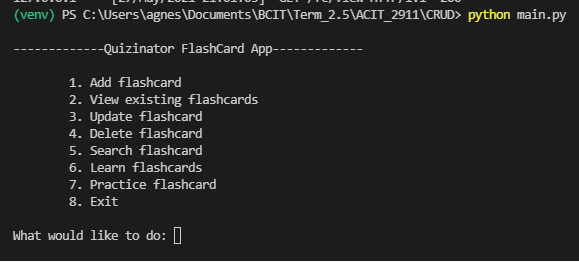

- Add flashcard: You can enter the Term and Definition
   
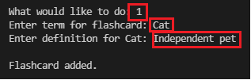

- View existing flashcards: You can see all the cards in your set
   
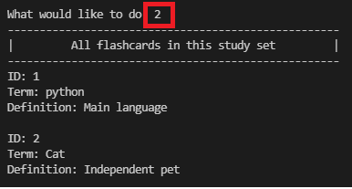

- Update flashcard: You can edit specific flashcards
   
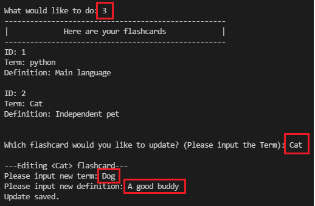

- Delete flashcard: You can delete an existing flashcard
   
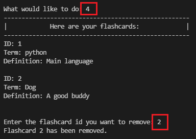

- Search flashcard: Search for specific flashcard
   
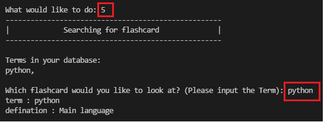

- Learn flashcards: Going over flashcards "flipping" card over for the answer
   
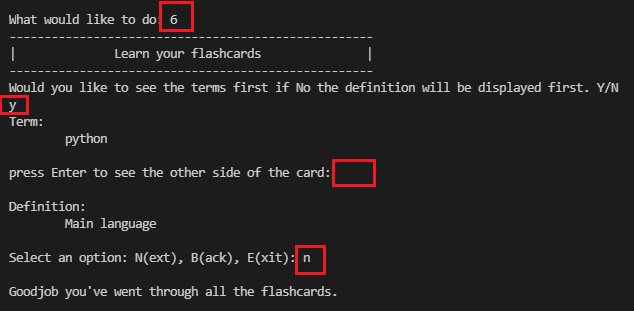

- Practice flashcard: Testing yourself by requiring you to type in the correct definition
   
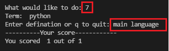

### Web
1. Start web application with command: `python app.py`
2. In browser, go to `localhost:8000/fc` to access the homepage
  
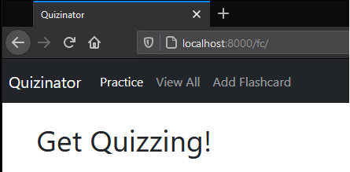

- You can add new flashcards by using the navigation bar and going to `Add Flashcard`
   
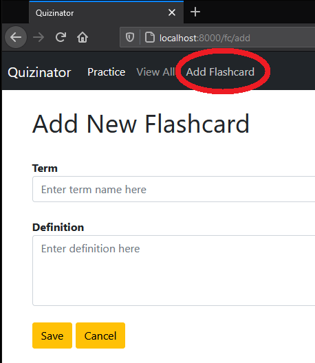

- You can view the list of your flashcards and access specific cards to edit or delete under `View All`
   
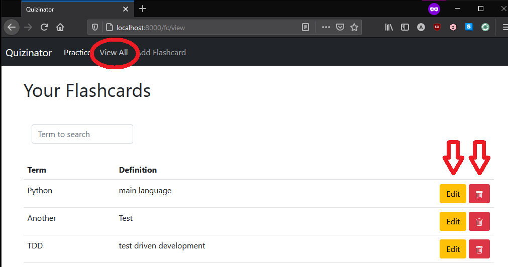

- You will also be able to test your knowledge and memory under `Practice`
   
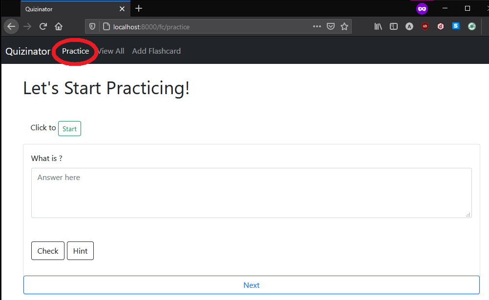
